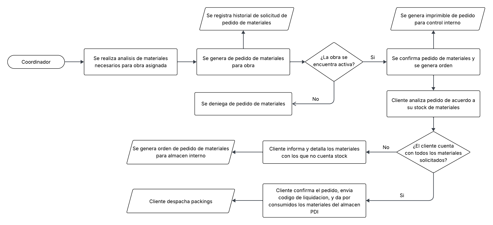
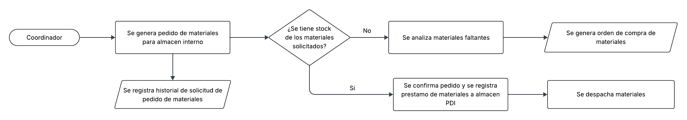
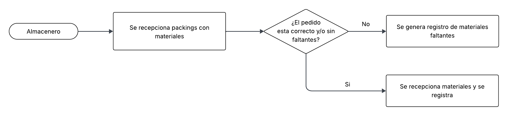
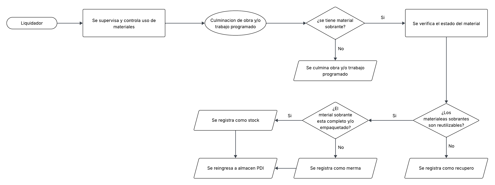

# depot-sys

## Gestión de Materiales - Diagramas de Flujo
Este repositorio contiene los diagramas de flujo relacionados con el proceso de **pedido, despacho y recepción de materiales**.

### 1. Proceso de pedido de materiales

#### Descripción:
El proceso de pedido de materiales es el cual las contratas realizan la gestión de pedido de materiales al cliente (principalmente empresas de distribución de electricidad y telecomunicaciones).
Inicialmente las contratas deben de realizar el análisis de materiales necesarios para los trabajos programados y/o obras asignadas. Posteriormente generan una orden de pedido, la cual será entregada al cliente; con ello el cliente asigna los materiales respectivos al PDI (código identificador único para cada área contrata).
En caso el cliente no cuente con disponibilidad de algún material, se informa a las contratas; ellos gestionaran internamente un pedido de materiales, que funcionara a modo de préstamo hacia el cliente. Los materiales utilizados en las obras y pertenecientes a las contratas deben ser repuestos por el cliente posteriormente.

---

### 2. Proceso de despacho de materiales

#### Descripción:
Para el correcto flujo de los procesos, antes de continuar con el proceso de despacho de materiales se debe culminar exitosamente la gestión del pedido de materiales.
Con lo previamente mencionado correctamente realizado, el cliente analizara y gestionara internamente la disponibilidad de los materiales solicitados.
Por el lado de las contratas el liquidador debe realizar el control y verificación de los materiales solicitados; el cliente confirma los materiales que verifique y envía un código de liquidación, luego el cliente liquida y da por consumidos los materiales del almacén PDI.
Los materiales confirmados se despachan en Packings y/o packages, cada uno de ellos contiene una parte del total del pedido realizado. El total de materiales asignados a un PDI, para una obra o trabajo programado, se entrega en varios Packings/Packages, cada uno con su respectiva guía de remisión.
Cuando los materiales para las obras o trabajos programados provienen del almacén interno de las contratas, se analiza gestiona y despacha de forma interna, asignando igualmente los materiales a un PDI a modo de préstamo.

---

### 3. Proceso de entrega y cuadre de materiales

#### Descripción:
Después de enviarse los materiales en Packings y/o packages, estos son recibidos por el almacenero de la contrata e ingresados en el almacén de obra, con su PDI correspondiente. Durante la obra la contrata supervisa y controla los materiales usados; posteriormente, al culminar la obra se realiza un cuadre de materiales, el material sobrante se procesa de acuerdo al estado en el que se encuentre.
Cuando se tiene pequeñas partes de material en condiciones idóneas para el uso, se reingresa a almacén como merma; cuando se tiene material sobrante por paquetes y/o material entero, en buenas condiciones, se reingresa a almacén como stock. También existen casos en los cuales el material sobrante y/o recuperado no se encuentra en condiciones para ser reutilizado; en estos casos el material se registra como recupero.

---